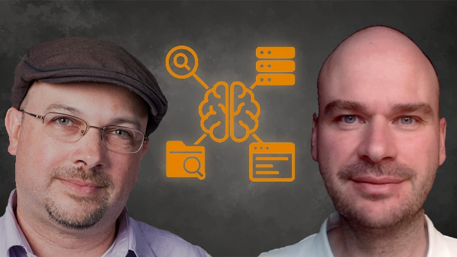

# 🤖 AI Agents Crash Course: Build with Python & OpenAI

---

## 📚 **Enrolled Student? Start Here!**

1. **📖 Bookmark course materials** - Go to [**COURSE_RESOURCES.md**](./COURSE_RESOURCES.md) for all code & exercises

2. **🍴 Fork this repository** - Click "Fork" button (top right) to create your own copy
> 💡 **Why fork?** We are going to deploy our solution to the cloud and you'll need your own GitHub repo for that!
3. **Click _Code_ and start a codespace. You'll be up and running in a minute!** 

---

## 🚀 From Zero to Production AI Agents in 4 Hours

The most practical, hands-on course for building **Agentic AI systems** with **OpenAI's Agents SDK**. No fluff, just code.

### What You'll Build

A complete **AI-powered nutrition assistant** featuring:
- 🧠 Natural language understanding with OpenAI's Agents SDK
- 🔧 Tool calling for external API interactions
- 📚 RAG for contextual intelligence
- 💾 Memory systems for conversation continuity
- 🛡️ Guardrails for safe, reliable behavior
- ☁️ Cloud deployment with authentication

## 🎯 Course Outline

**Hour 1: Foundations**
- Build & debug your first OpenAI agent
- Master tool calling and API integration

**Hour 2: Advanced Capabilities**
- Implement RAG for knowledge retrieval
- Work with Model Context Protocol (MCP)

**Hour 3: Multi-Agent & Production**
- Design multi-agent orchestration
- Add memory, prompt engineering, guardrails

**Hour 4: Deploy to Production**
- Build production-grade chatbot
- Deploy to cloud platforms

## 🔑 What You'll Learn

✅ Build **autonomous AI agents** using OpenAI's latest SDK  
✅ Implement **tool calling** and **RAG systems**  
✅ Create **multi-agent orchestration** workflows  
✅ Deploy **production-ready agents** with authentication  
✅ Master **prompt engineering** and **guardrails**  

## 🚦 Prerequisites

- Basic Python knowledge (functions, loops, OOP basics)
- OpenAI API key (instructions in course)
- Enthusiasm to build! 🎯

## 👨‍🏫 Your Instructors

**Frank Kane** - Ex-Amazon/IMDb, 17 patents in ML, 1M+ students  
**Zoltan C. Toth** - 20+ years AI infrastructure, Ex-Databricks instructor
